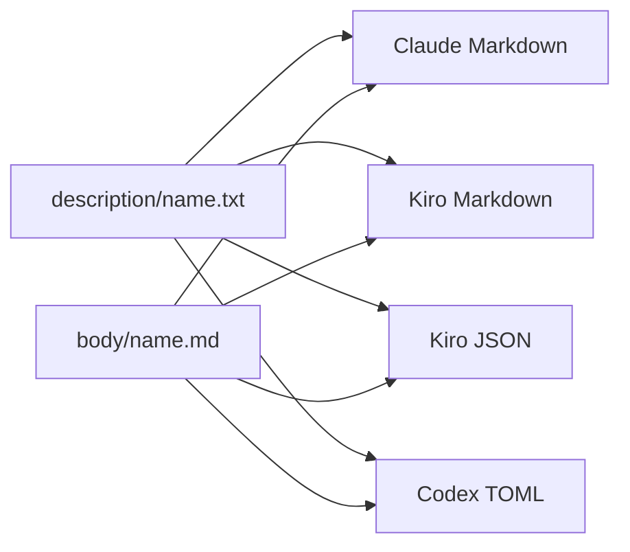

# エージェント指示本文の共通化と Codex 対応設計

## 目的

Claude Code と Kiro で重複している6 agentのdescriptionと指示本文を `.chezmoitemplates/agents/` に集約し、同じdescriptionと本文からClaude Code、Kiro、Codexの各形式を生成する。Codexには公式のcustom agent形式で6 agentを追加する。

## 対象

| Agent | Codex sandbox |
|---|---|
| `build-error-resolver` | `workspace-write` |
| `code-reviewer` | `read-only` |
| `doc-updater` | `workspace-write` |
| `planner` | `read-only` |
| `python-reviewer` | `read-only` |
| `refactor-cleaner` | `workspace-write` |

Claude CodeだけにあるGAN関連agentは対象外とする。

## 構成

`.chezmoitemplates/agents/description/<name>.txt` は1行のdescription、`body/<name>.md` は指示本文を持つ。名前、ツール、権限、sandboxなどのプラットフォーム固有設定は各出力テンプレートに残す。ファイル全体の形式が異なるため、`dot_agents/agents` とシンボリックリンクは使わない。

## Claude Code

対象の `dot_claude/agents/<name>.md` を `<name>.md.tmpl` に変える。YAML frontmatterの `description` と本文を共通テンプレートから展開し、ほかのfrontmatterを維持する。生成後のMarkdownは現在のファイルと一致させる。

## Kiro

対象の `dot_kiro/agents/<name>.md` を `<name>.md.tmpl` に変える。YAML frontmatterの `description` と本文を共通テンプレートから展開し、ほかのKiro用frontmatterを維持する。

対象の `dot_kiro/agents/<name>.json` も `<name>.json.tmpl` に変える。`description` と `prompt` を共通テンプレートからJSON文字列として埋め込み、ほかのフィールドと権限を維持する。

## Codex

`dot_codex/agents/<name>.toml.tmpl` を6件追加する。各ファイルは公式仕様の必須項目 `name`、`description`、`developer_instructions` を持つ。`description` と `developer_instructions` は共通テンプレートからTOML文字列として埋め込む。

モデルとreasoning effortは指定せず、親Codexセッションから継承する。sandboxは既存agentの役割に合わせ、レビュー・計画系を `read-only`、修正系を `workspace-write` とする。MCP設定は親セッションから継承する。

## 変更対象

- Create: `.chezmoitemplates/agents/description/*.txt` 6件
- Create: `.chezmoitemplates/agents/body/*.md` 6件
- Rename and modify: `dot_claude/agents/*.md` 6件を `*.md.tmpl` へ変更
- Rename and modify: `dot_kiro/agents/*.md` 6件を `*.md.tmpl` へ変更
- Rename and modify: `dot_kiro/agents/*.json` 6件を `*.json.tmpl` へ変更
- Create: `dot_codex/agents/*.toml.tmpl` 6件

## エラー処理

- 共通descriptionまたは本文が欠けている場合はchezmoiのテンプレートエラーとして停止し、不完全なagent定義を生成しない。
- Kiro JSONが無効な場合は適用せず、既存定義を残して修正する。
- Codex TOMLが認識されない場合は適用済みファイルを確認し、agent名、必須項目、TOML構文を修正する。

## 検証

- 6件すべてでClaude CodeとKiroの生成済みMarkdownが変更前と一致することを確認する。
- Kiro JSON 6件を `jq` で解析し、`description` と `prompt` が共通テンプレートと一致し、既存の権限フィールドが変わっていないことを確認する。
- Codex TOML 6件に必須項目と想定したsandboxが含まれることを確認する。
- chezmoi適用後、`~/.codex/agents/` に6件のTOMLが生成されることを確認する。
- 新しいCodexセッションで6 agentが認識され、`code-reviewer` を明示的に指定できることを確認する。

Codex custom agentの形式は公式の [Subagents](https://learn.chatgpt.com/docs/agent-configuration/subagents.md) に従う。
